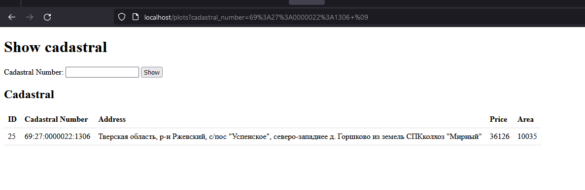
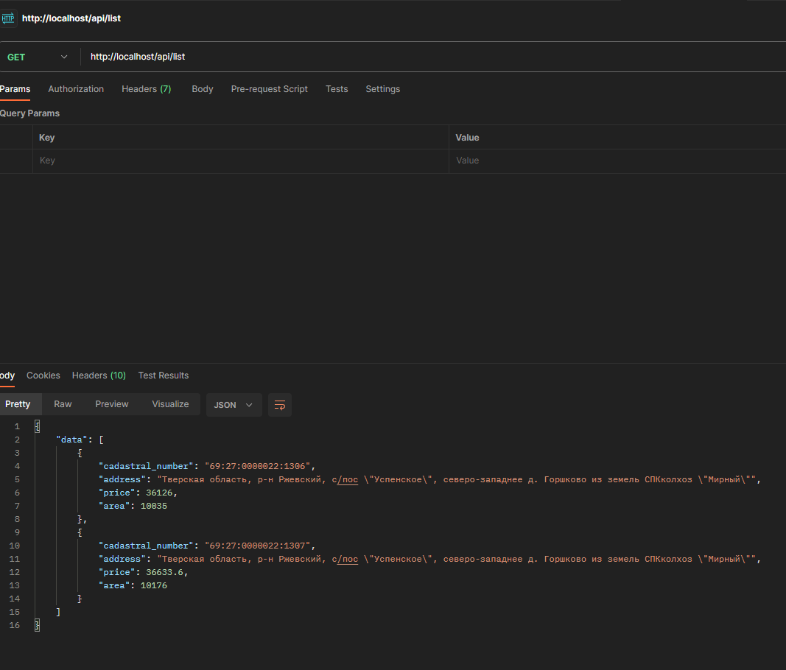
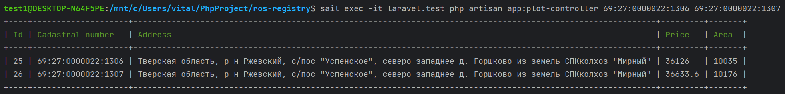

# Ros-registry

## 1. Создаем ключ
```
php artisan key:generate
```

## 2. Запускаем команду обновляющую нашу бд каждый час
```
sail exec -it laravel.test php artisan schedule:work
```

## Запрос на получение через API
```
http://localhost/api/list
```

## Запрос на получение через WEB
```
http://localhost/plots
```

## Запрос на получение через консоль
```
sail exec -it laravel.test php artisan app:plot-controller 69:27:0000022:1306 69:27:0000022:1307
```

## Поднимаем докер
```
sail up -d
```

## Кладем докер
```
sail down
```

## Добавление алиаса к sail
```
alias sail='bash vendor/bin/sail'
```

Результат работы:
 

 

 
